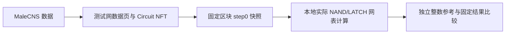

# Drosophila / droso

基于 **MaleCNS v1.0 的明确神经元内部连接图**，本项目构建了由实际 NAND/LATCH 网表执行的整数神经模型：**166,700 个神经元、25,582,938 条内部有向连接、10,419 枚独立 Circuit NFT**。数据和这些 NFT 已部署并托管在 BSC Testnet；公开包包含两个本地时间步之前的完整快照，可以重新计算并逐神经元核对结果。每枚 Circuit 为 **56 NAND + 3 LATCH、404 bytes**。

这是社会实验与工程模型；两步验收发生在本地，不宣称真实果蝇行为、糖响应、意识或论文功能等价。



## 网络与部署

### BSC Mainnet，chainId 56

**CONTRACTS_ONLY_DEPLOYED：五个项目合约已部署，指定 Processor 已绑定；数据上传、模块配置、全量制造和组装尚未完成。** 10,419 是候选制造任务目标，不是主网完成数量。

| 角色 | 主网地址 / BscScan |
| --- | --- |
| Assembly Proxy：对外组装入口 | [0xFc970a468649261324DD11A38Cc532b717bDf1eE](https://bscscan.com/address/0xFc970a468649261324DD11A38Cc532b717bDf1eE) |
| 既有 Processor / Circuits | [0xD72Cfc1D2F8B659ce1Ae441Ae18c3c0f9A3710C5](https://bscscan.com/address/0xD72Cfc1D2F8B659ce1Ae441Ae18c3c0f9A3710C5) |
| 该 Processor 实际绑定的 Factory | [0x68224F668083c29e9800Be2a646d42d18cedF7e2](https://bscscan.com/address/0x68224F668083c29e9800Be2a646d42d18cedF7e2) |
| StaticMicroData：数据页目录 | [0x9EC103817da8642339315F21e721aB289B47fC2f](https://bscscan.com/address/0x9EC103817da8642339315F21e721aB289B47fC2f) |
| 项目 Beacon：组装器升级指针 | [0xeecF62291a624Edbe6e3324F9b73A2afa91C3581](https://bscscan.com/address/0xeecF62291a624Edbe6e3324F9b73A2afa91C3581) |
| 组装逻辑 implementation | [0x5dc8d01DA5517fCe1C9e127DBa32ae7118B17B0c](https://bscscan.com/address/0x5dc8d01DA5517fCe1C9e127DBa32ae7118B17B0c) |
| Proxy 一次性存储初始化器 | [0x7b3b7992586E452B7f2c8b42901A472710B86635](https://bscscan.com/address/0x7b3b7992586E452B7f2c8b42901A472710B86635) |

本次只读观察区块 **122755113**：已注册页 0/51,567、已配置模块 0/10,419、已托管 NFT 0/10,419，`sealed=false / ready=false / completedSteps=0 / active=false`。这是带区块的观察，不是永久实时值。部署报告记录目标任务制造完成数为 0，不能据此推断 Processor 整个合集历史总供应为 0。

五笔创建实际支出 **0.0004089094 BNB**，不含既有 Processor 创建、未来数据、NFT、托管或运行费用。主网 BNB 与测试网 tBNB 分开记录。

[主网详细架构、协议依赖与升级权限](docs/MAINNET_DEPLOYMENT.md) · [唯一角色地址清单](deployments/bsc-mainnet/addresses.json) · [五笔实际创建回执](deployments/bsc-mainnet/receipts-index.json) · [固定区块只读观察](deployments/bsc-mainnet/current-observation.json)。

**这些地址用于查看合约和进度，不是直接转入 BNB 或 NFT 的指引。** 项目 Beacon owner 能升级组装逻辑，包括托管规则；不能把它理解为已锁定、多签或已经过独立审计。

仅需自己的 `BSC_MAINNET_RPC_URL`（`.env.example` 中为空）：

```sh
npm run status:mainnet
# 可选：同时复核五笔部署回执及其 canonical 区块
npm run status:mainnet -- --verify-deployment
```

无 RPC 为 NOT_RUN，访问失败为 UNAVAILABLE；不回退到测试网。报告写入 `results/mainnet-status.json`，不会覆盖历史部署记录。查询成功也不代表主网全脑验收。

### BSC Testnet，chainId 97

网络：**BNB Smart Chain Testnet，chainId 97**。以下是本项目使用的部署，不代表上游官方背书。电脑是主要计算端；这些浏览器入口均指向测试网。

| 用途 | 实际地址 / 测试网浏览器 |
| --- | --- |
| Factory：创建协议实例 | [0x076e383ff2e490A493f1f5c4359e922C46c54c01](https://testnet.bscscan.com/address/0x076e383ff2e490A493f1f5c4359e922C46c54c01) |
| Circuits / Processor：独立电路 NFT | [0xa21f3a3ef5EBc12A687eCf168a9C1937E5FE4486](https://testnet.bscscan.com/address/0xa21f3a3ef5EBc12A687eCf168a9C1937E5FE4486) |
| Transistors：NAND/LATCH 材料 | [0x7795fdaBdF41eF0cF549FD0a2aa8b76719E10b78](https://testnet.bscscan.com/address/0x7795fdaBdF41eF0cF549FD0a2aa8b76719E10b78) |
| Assembly：配置、托管及集齐屏障 | [0xbe0d3af811fbdf9e5fcdc421b56fb001239efd51](https://testnet.bscscan.com/address/0xbe0d3af811fbdf9e5fcdc421b56fb001239efd51) |
| StaticMicroData：不可变数据页目录 | [0x827F41F43be699ca7f2255b8bF19dFbE8122f1bD](https://testnet.bscscan.com/address/0x827F41F43be699ca7f2255b8bF19dFbE8122f1bD) |

默认历史锚点是 **131798986**，hash `0x4b09598a04faf3f8f6cb635dc1d6776733b0c66713ba86ced57b870c23293c54`。该快照 `ready=true / completedSteps=0 / active=false`，表示两个本地时间步之前的状态，**不是实时状态声明**。

- [验收说明](docs/ACCEPTANCE.md) · [部署信息](deployments/bsc-testnet/deployment.json)
- 原签名证据：[托管与 ready](deployments/bsc-testnet/ready.json) · [链数据重建](deployments/bsc-testnet/rebuild-report.json) · [两步本地验收](deployments/bsc-testnet/local-acceptance-signed.json)
- [测试前快照说明](docs/FORMAT_AND_BUILD.md) · [step0 锚点](snapshots/initial/release.json) · [31 个分片清单](bundles/export-manifest.json) · [全部发行文件校验清单](checksums/files.json)
- [实际核心网表](core/core.bin) · [核心生成器](src/micro-core.ts) · [网表解释器](src/binary-gates.ts) · [全量门级运行器](src/packed-micro.ts)
- [组装合约源码](contracts/BrainAssemblyMicroPages.sol) · [数据合约源码](contracts/StaticMicroData.sol) · [准确编译输入](build/compiler-input.json)
- 完整预期结果：[step1](expected/step1.states.txt.gz) · [step2](expected/step2.states.txt.gz) · [固定摘要](expected/steps.json)
- [历史链核对与自动续查](docs/HISTORICAL_VERIFY.md)

## 快速离线复现

要求 Node.js >=22.18，建议64位系统、至少数GiB可用内存与约2GiB可用磁盘；这是工程建议，不是所有机器上的最低配置保证。

```sh
git clone https://github.com/HongH933/Drosophila.git
cd Drosophila
npm ci
npm run files:verify
npm run snapshot:verify
npm run reproduce -- --steps 2 --out results/my-first-run
npm run result:verify -- results/my-first-run/report.json
```

`results/my-first-run/report.json` 给出结果、耗时、内存、机器环境和检查点；`step1.states.txt` / `step2.states.txt` 给出每个bodyId的电位和脉冲。输出目录必须尚不存在。再次运行请选择新目录。

程序校验31个分片、历史签名与固定摘要，从历史区块实际数据重建step0，解释执行真实网表；每步与独立整数参考逐神经元比较，最后检查固定预期摘要。预存结果不参与计算。

### 独立进程的部分恢复

```sh
npm run reproduce -- --save-partial-and-exit --out results/partial
npm run reproduce -- --resume results/partial/report.json --out results/resumed
```

第一条在非时间步边界保存后退出，第二条为独立进程。每次检查点使用不可变代次，输入快照和原代次不覆盖。按每进程10分钟/约1.5GiB RSS预算保存PARTIAL，不当作PASS。

## 历史区块与当前状态分开核对

```sh
cp .env.example .env
# 在 .env 中填写自己的 BSC_TESTNET_RPC_URL；无需任何钱包字段。
npm run verify:chain -- --mode sample --out results/history-sample.json
npm run verify:chain:full-run -- --out results/full-history
npm run status:chain
```

历史RPC必须提供区块 **131798986** 的状态。优先使用blockHash+requireCanonical；节点明确拒绝该参数时固定区块号，并在每组前后核对hash；历史状态不可用时报告UNAVAILABLE，绝不改读latest冒充通过。sample为公开固定种子选择32槽/32页；full覆盖全部10419槽/51567页。自动 full 入口每段最多10分钟/30000请求，整次最多6小时/300000请求；同一个命令可接续已保存进度。发生 UNAVAILABLE 或 FAILED 不会无限重试。单段工具也可手动恢复：

```sh
npm run verify:chain -- --mode full --out results/history-full.json
# 若上条得到 PARTIAL，再续查：
npm run verify:chain -- --mode full --resume results/history-full.json.checkpoint.json --out results/history-full-next.json
```

本地续查检查点是你本机保存的进度；摘要检测文件损坏，不是第三方信任证明。需要独立重新审计时不用 `--resume`。RPC读取加历史发布者签名并不等于独立验证BSC共识。`status:chain` 用新块报告当前状态；历史曾ready不意味着今天仍ready。

## 已锁定的证据链

历史数据与step0初态 → 确定性重建 → 实际网表两步本地计算 → 独立整数参考及历史验收期望一致。

- chainId：97；历史区块：131798986。
- blockHash：`0x4b09598a04faf3f8f6cb635dc1d6776733b0c66713ba86ced57b870c23293c54`。
- 原snapshot摘要：`a3e09d8b64310618ffe1f5ca10cb56b6a1495ebbf45bb3c441bb75502872e34e`。
- 第一步：77465个脉冲，`774874e05e230b261427ff79348dea76a8088f86589f2fcb3a07eac5aa89eb8a`。
- 第二步：32695个脉冲，`5ffda5019a0eaf1dd93fdc1cda0737fd88031e2401ac67dc63b541f88a683bb5`。

**链上completedSteps为0。两个本地结果不是该区块中已提交的链上step1/step2。** 历史运行约134秒只指本地计算/保存，不包括获取全部RPC快照；约628MiB为那次进程峰值，不是最低系统配置承诺。

## 当前模型限制

当前profile是显式工程压力模型 `malecns-m3-balanced-unresolved-stress-v1`。3468项未决输出符号按bodyId哈希分配正负；全部神经元初始脉冲为1。它们不是已批准的生理参数。数据图一致、所选整数模型一致、生物学功能等价是三个不同命题。

底层TapeOut匹配源码仍有缺口，独立安全审计未完成。公开源码或测试网验收不授予主网制造、真实资产托管或预算批准。本工程不含公共交易发送器。

## 内容与其他命令

- [模型与数据](docs/MODEL_AND_DATA.md)：精确方程、范围、参数、边界与hash规则。
- [架构、快照和编译](docs/FORMAT_AND_BUILD.md)：载荷、状态与合约复现。
- [验收记录](docs/ACCEPTANCE.md)：独立干净环境与新工具实测。
- [限制、安全和费用](docs/SECURITY_AND_COSTS.md)。
- [来源与许可证](NOTICE.md)。
- [发行文件与私有化前检查](docs/PUBLISHING.md)。

```sh
npm test
npm run typecheck
npm run core:verify
npm run data:verify
npm run build:contracts
npm run build:mainnet
npm run release:pack
```

最后一条只生成本地发行压缩包和文件清单，不发布。可公开整个文件清单中的工程（包含bundles），或分发完整压缩包；不提供不存在的Release链接。不包含原Git历史、node_modules、个人RPC或运行日志。

完整结果重新加载核验：

```sh
npm run result:verify -- results/my-first-run/report.json
npm run tasks:export
npm run files:verify
```

`tasks:export`只从已核验快照导出10419项清单、真实tokenId、bodyId、规格、物料及原tapeout calldata用于审阅，不发送、不重新制造。`files:verify`检查随发行包提供的完整文件清单。
